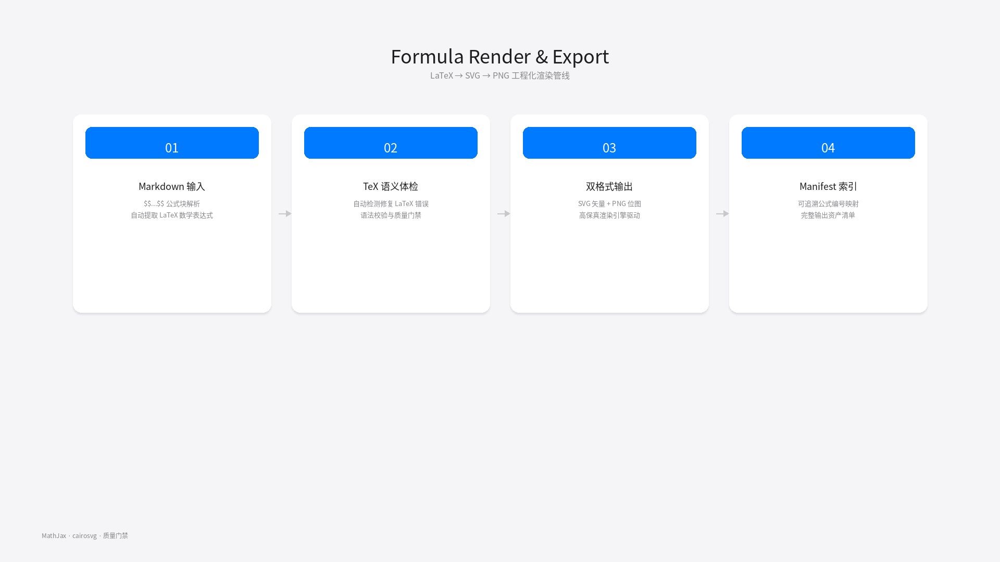
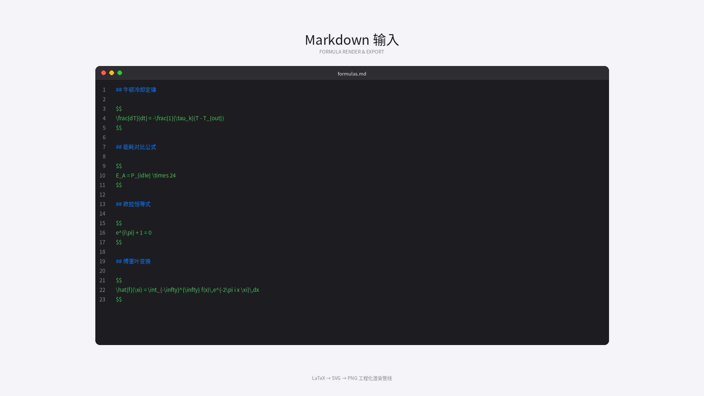
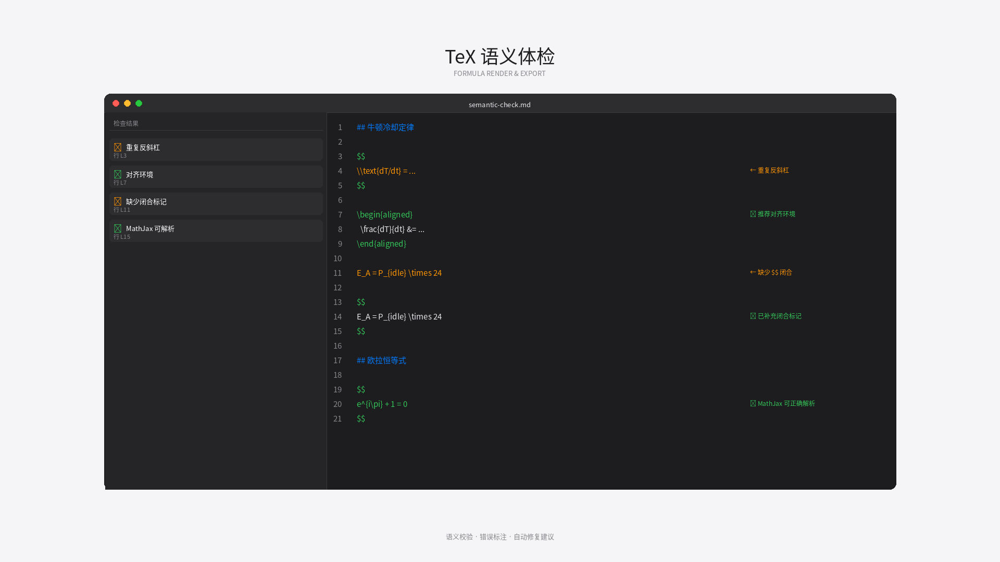
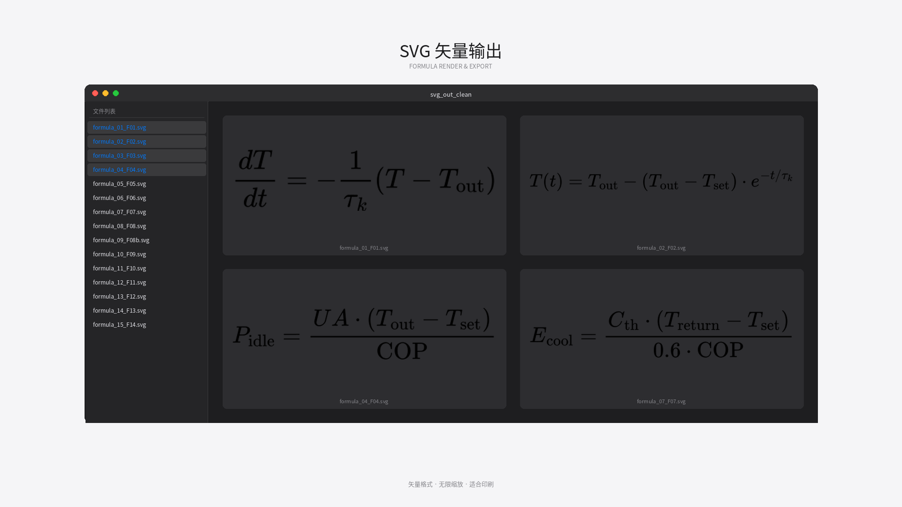
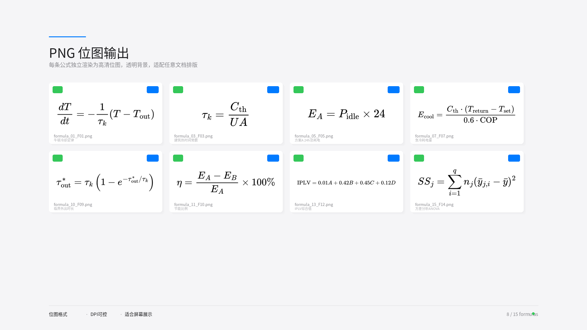
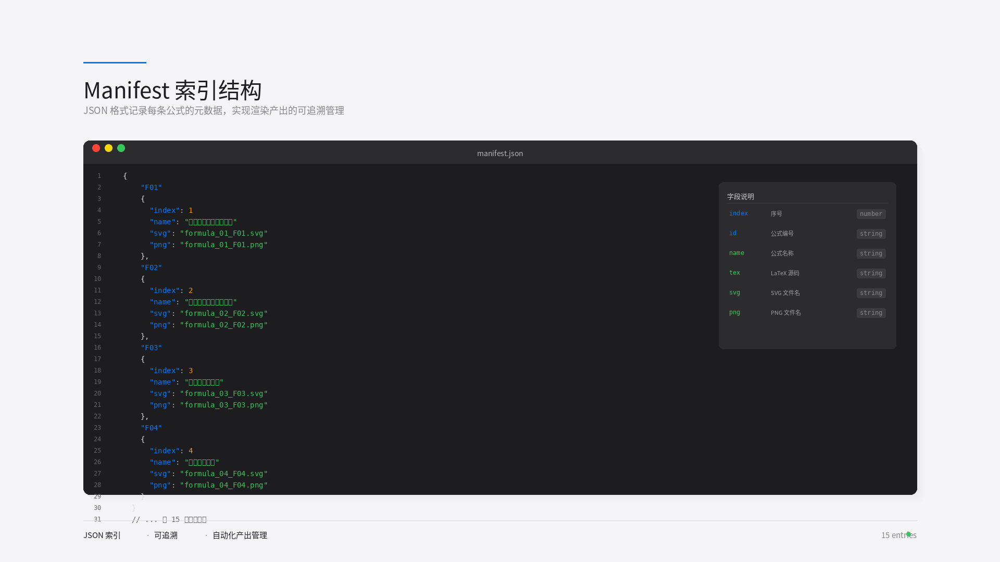

# Formula Render & Export

LaTeX → SVG → PNG 工程化渲染管线 —— 每条公式单文件，可追溯、可复用。

## 作品渲染

| Markdown输入 | TeX语义体检 | SVG矢量输出 |
|:---:|:---:|:---:|
|  |  |  |

| PNG位图输出 | Manifest索引 |
|:---:|:---:|
|  |  |

## 工作流

1. **Markdown输入** — `$$...$$` 公式块解析
2. **TeX语义体检** — 自动检测修复LaTeX错误
3. **双格式输出** — SVG矢量 + PNG位图
4. **Manifest索引** — 可追溯公式编号映射

## 技术栈

`MathJax` `Node.js` `cairosvg` `Python` `LaTeX` `SVG` `PNG`
