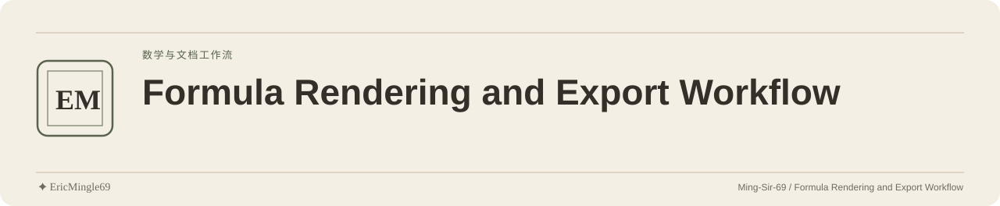

<picture>
  <source media="(prefers-color-scheme: dark)" srcset="readme-assets/header-dark.svg">
  <source media="(prefers-color-scheme: light)" srcset="readme-assets/header-light.svg">
  
</picture>

  <a href="README.md">简体中文</a> · <a href="README.en.md">English</a> · <a href="PERSONAL-NOTICE.md">✦ EricMingle69</a>

# 公式渲染与导出工作流

## 项目定位

用于将 Markdown 的 display math 公式按条导出 SVG 与 PNG，并通过 manifest 关联文件的 Skill 契约与作品示例。

## 阅读入口

| 入口 | 内容 |
| --- | --- |
| [输入输出契约](SKILL.md) | 公式解析、语义检查与输出要求 |
| [开发说明](README_DEV.md) | 实现思路和后续方向 |
| [作品示例](作品渲染图/) | 输入、检查、SVG、PNG 与 manifest 预览 |
| [流程封面](作品封面图.png) | 保存的展示图 |

## 从哪里开始

1. 准备包含 `$$...$$` 公式块的 Markdown，按 Skill 确定输入文件与输出目录。
2. 按文档完成 TeX 语义检查，再以 MathJax 生成 SVG、Python/cairosvg 转换 PNG。
3. 每条公式分别输出文件，用 manifest 对应编号与文件名；逐条检查完整性和数量。

## 使用边界

- 当前仓库只有文档与图片，未提交可直接运行的渲染脚本、依赖清单或安装包。
- 执行者仍需准备 Node.js/MathJax 与 Python/cairosvg 环境及所需实现。
- 行内公式、PDF 输出和多 Markdown 批处理是开发方向，不能作为已交付能力。
- 作品截图说明交付形态，不证明任意 LaTeX 输入均能正确渲染。

## 来源与原有许可

MathJax、cairosvg 和其他工具保留各自来源与许可。原仓库没有 LICENSE/NOTICE，既有文档、公式示例与图像的复用范围未明确。

---

文档维护：**✦ EricMingle69** · [Ming-Sir-69](https://github.com/Ming-Sir-69)  
[个人标识、许可与权限说明](PERSONAL-NOTICE.md) · 明暗页眉随 GitHub 主题自动切换。
