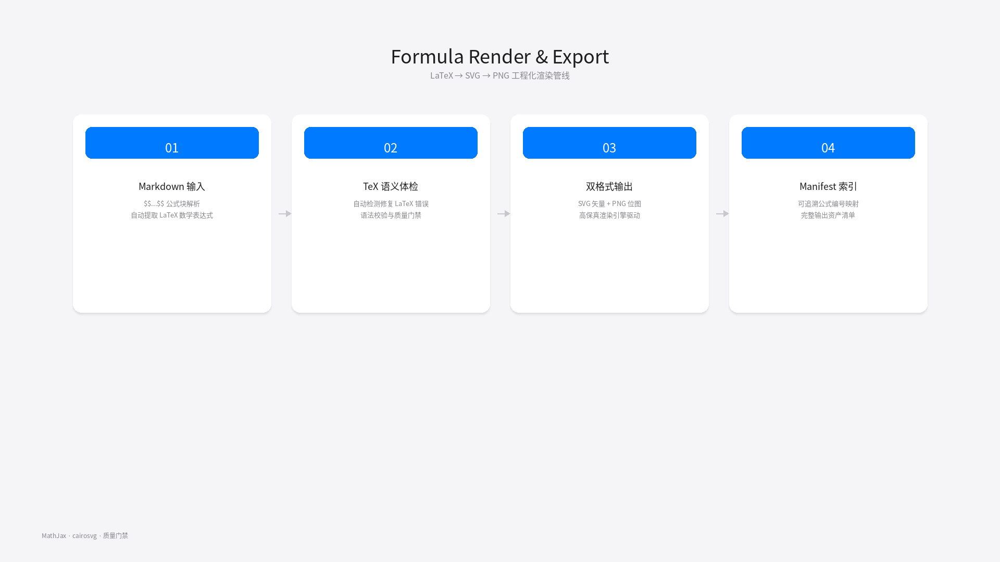
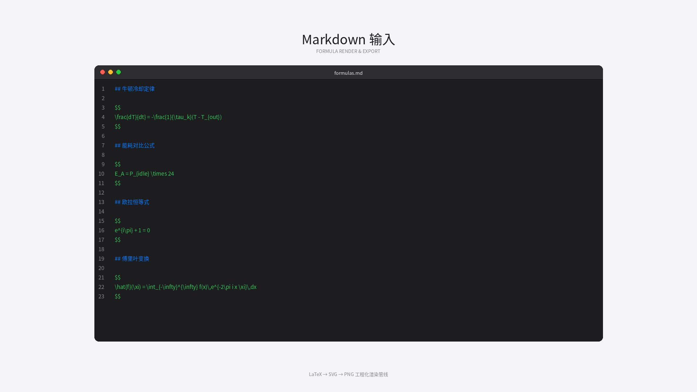
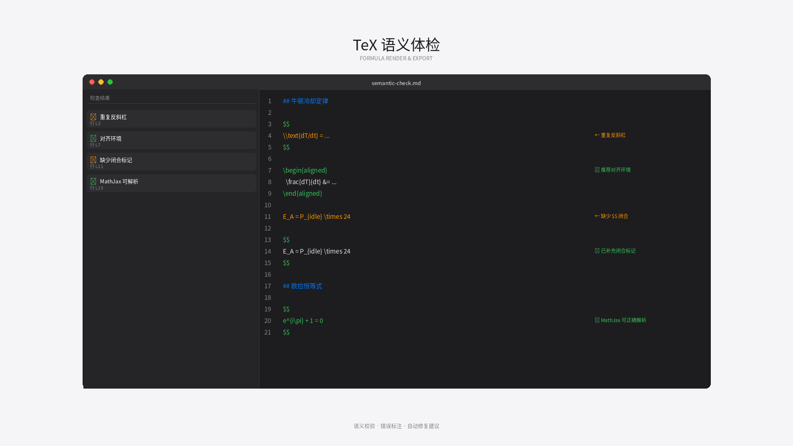
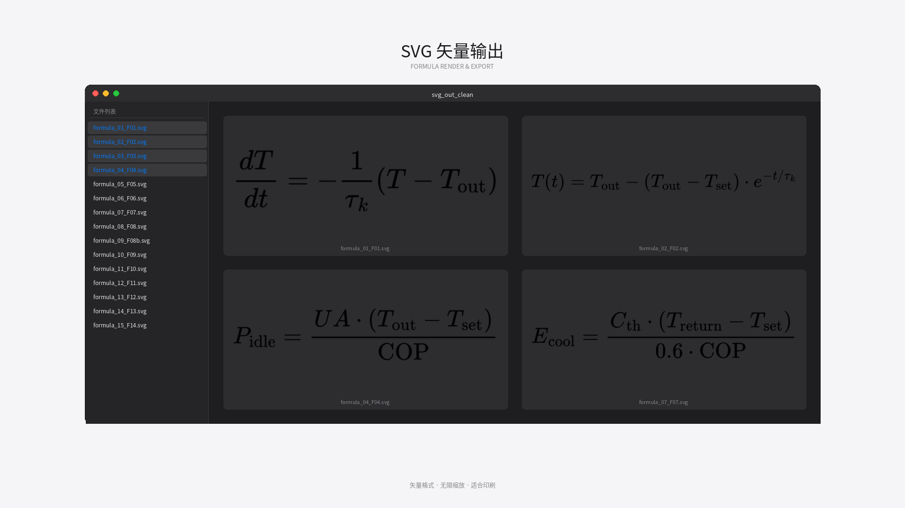
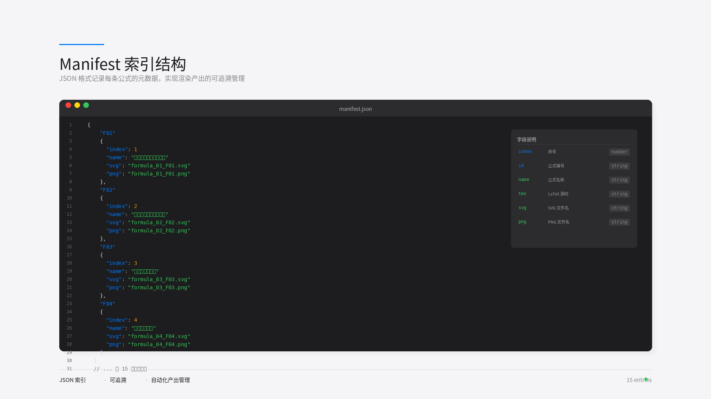

# Formula Render & Export

LaTeX → SVG → PNG 工程化渲染管线 —— 每条公式单文件，可追溯、可复用。

## 适合谁与上手入口

适合需要把 Markdown 中的 display math 公式拆成独立图片、用于报告与演示文稿的用户，以及希望让 Trae SOLO / AI Agent 按固定契约完成公式资产交付的维护者。

- [SKILL.md](SKILL.md)：输入输出契约、TeX 语义体检、MathJax SVG 与 PNG 转换流程。
- [README_DEV.md](README_DEV.md)：实现思路、TeX 写法与后续开发方向。
- 下方作品渲染：查看流程与交付形态的图片示例。

准备含 `$$...$$` 公式块的 Markdown，再按 Skill 确认输入路径与输出目录。该仓库当前是流程 Skill 与作品归档，未提交可直接调用的渲染脚本、依赖清单或一键启动命令；执行者需按文档准备环境与临时实现。

## 作品渲染

| Markdown输入 | TeX语义体检 | SVG矢量输出 |
|:---:|:---:|:---:|
|  |  |  |

| PNG位图输出 | Manifest索引 |
|:---:|:---:|
|  |  |

## 工作流

1. **Markdown输入** — `$$...$$` 公式块解析
2. **TeX语义体检** — 自动检测修复LaTeX错误
3. **双格式输出** — SVG矢量 + PNG位图
4. **Manifest索引** — 可追溯公式编号映射

## 技术栈

`MathJax` `Node.js` `cairosvg` `Python` `LaTeX` `SVG` `PNG`

## 状态与限制

当前文档以 display math 为输入，每条公式分别输出 SVG 与 PNG，并用 manifest 关联公式和文件名。行内公式、PDF 输出和多 Markdown 批处理在开发文档中列为后续方向。流程涉及 Node.js/MathJax 与 Python/cairosvg；结果仍需逐条检查完整性和 manifest 数量，截图不代表所有输入均已通过验证。

## 贡献与维护

欢迎通过 Issue 或 Pull Request 补充可公开的公式样例、语义错误复现、输出契约与文档改进。提出实现时请说明依赖、输入输出和验收方法；避免引入未经授权的论文或客户内容。

仓库维护：[Ming-Sir-69](https://github.com/Ming-Sir-69)。当前没有 LICENSE 或 NOTICE，文档、示例与图像的复用许可待确认。
